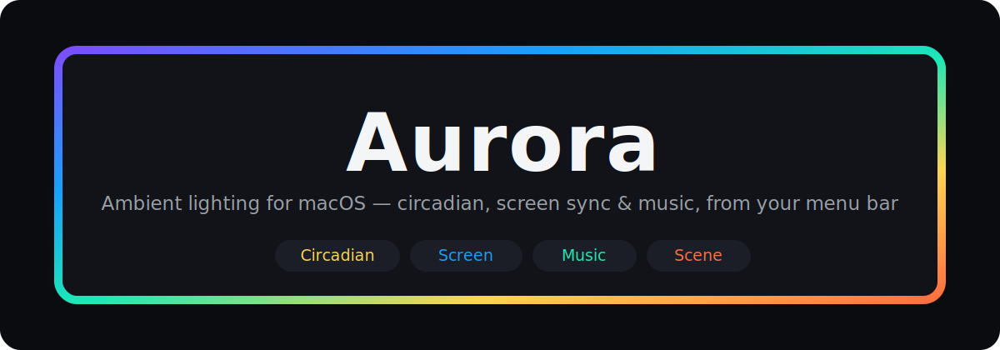

<div align="center">



# Aurora

**Native macOS ambient lighting for Skydimo-compatible LED strips —
circadian, screen sync & music sync, all switchable from your menu bar.**

[](https://www.apple.com/macos/)
[](https://www.swift.org)
[](LICENSE)
[](https://github.com/b0ver/aurora/releases)
[](https://github.com/b0ver/aurora/stargazers)

</div>

---

Aurora is an independent, native reimagining of the Skydimo desktop app for the
people who want their bias lighting to be *ambient automation*: a flux-style
circadian glow by day and night, faithful screen-edge sync for movies and games,
audio-reactive lighting for music — and the one thing the original never had,
**mode switching right from the menu bar**.

It drives the same USB-serial controllers as the official app (reverse-engineered
for interoperability), runs as a lightweight menu-bar agent, and is built
entirely in Swift 6 / SwiftUI.

## ✨ Modes

| | Mode | What it does |
|---|---|---|
| 🌅 | **Circadian** | Color temperature tracks your local sun cycle (f.lux-style): cool by day, warm + dim at night. Auto / Day / Night override, a live 24-hour schedule graph with a time scrubber, and gamma-corrected warm tones so amber looks like amber. |
| 🖥️ | **Screen Sync** | Mirrors the colors at the edges of your screen onto the strip via `ScreenCaptureKit`. Regions: Full · Cinema (letterbox-aware) · Top · Bottom · Left · Right, plus a saturation control. |
| 🎵 | **Music Sync** | Audio-reactive lighting from your **system audio** (no virtual device): `vDSP` FFT spectrum → Spectrum · Pulse · Level (VU) · Mood, with sensitivity and beat detection. |
| 🎨 | **Scene** | A steady color across the strip — custom color picker + 12 presets. |

Plus: a one-click **menu-bar switcher**, an **installation-direction** setup
(matches however your strip is wound around the screen), **launch-at-login**, and
a live on-screen preview.

## 🚀 Install

> macOS 14 (Sonoma) or later · a Skydimo-compatible USB-serial controller.

**Option A — download the app**

1. Grab `Aurora-vX.Y.Z-macos.zip` from the [latest release](https://github.com/b0ver/aurora/releases).
2. Unzip and move **Aurora.app** to `/Applications`.
3. First launch: right-click → **Open** (the build is ad-hoc signed, so Gatekeeper
   asks once).
4. For **Screen Sync** / **Music Sync**, grant **Screen Recording** in
   System Settings → Privacy & Security (Music Sync uses it for system audio),
   then quit and reopen Aurora.

Strip not detected, wrong colors, or mirrored effect? →
**[Troubleshooting](docs/TROUBLESHOOTING.md)** (most issues are the official
Skydimo app holding the USB port, a missing permission, or the install direction).

**Option B — build from source**

```bash
git clone https://github.com/b0ver/aurora.git && cd aurora
swift build                                 # compile
swift run AuroraChecks                      # run the logic checks
./Scripts/package_app.sh release install    # build + install into /Applications
```

(Only the Swift toolchain is needed — full Xcode is not required.)

## 🔌 Hardware

Aurora talks to Skydimo USB-serial controllers (e.g. the `SK01xx` monitor
light-strip family) over a CH340 bridge at 115200 baud. It auto-detects the
controller, identifies the model and LED count via a handshake, and streams
`Ada`-style frames. The protocol was reverse-engineered for interoperability —
see [docs/protocol/](docs/protocol/).

> **Tested on:** SK0127 — Skydimo 27″ monitor strip, **65 LEDs** (handshake,
> RGB channel order, all four modes, gamma, install direction). The 21/24/27/32/34″
> 3- and 4-sided strips and the "A" series are auto-detected and expected to work.
> Full model matrix: **[docs/COMPATIBILITY.md](docs/COMPATIBILITY.md)** ·
> reports for other models welcome.

## 🧠 How it works

A small render engine runs a continuous background loop at a fixed FPS: the active
mode produces a frame of per-LED colors, the engine applies brightness, and pushes
it to the controller (and an on-screen preview).

```
 SwiftUI (MenuBarExtra + window)
        │  observes / commands
 LightEngine ── render loop ──► LEDController (USB-serial)
        ▲ frame providers
 Circadian · ScreenCapture · MusicFFT · Static
        └─────────── AuroraCore (RGB · Kelvin · LEDLayout) ──┘
```

Built as focused Swift modules: `AuroraCore` (color/Kelvin/layout math),
`AuroraDevice` (serial protocol + auto-detect), `AuroraCircadian` (solar position
→ schedule), `AuroraCapture` (ScreenCaptureKit edge sampling), `AuroraAudio`
(vDSP FFT), `AuroraEngine` (render loop), and `AuroraApp` (UI). See
[docs/ARCHITECTURE.md](docs/ARCHITECTURE.md).

## 🗺️ Roadmap

Done: circadian · screen sync · music sync · scene · menu-bar switcher ·
installation setup · launch-at-login. Next: gradients & saved scenes,
time-based automation, global hotkeys, multi-monitor, and a notarized build.
Full plan in [docs/ROADMAP.md](docs/ROADMAP.md).

## 🤝 Contributing

Issues and PRs welcome — especially reports from other Skydimo controller models.
The codebase is small, modular, and documented (PRD, architecture, and ADRs live
in [`docs/`](docs/)).

## ⚖️ License & disclaimer

[MIT](LICENSE). Aurora is an independent interoperability project and is **not**
affiliated with, endorsed by, or built from Skydimo's source. "Skydimo" is used
only to describe hardware compatibility.

<div align="center">
<sub>If Aurora makes your desk glow nicer, consider leaving a ⭐.</sub>
</div>
